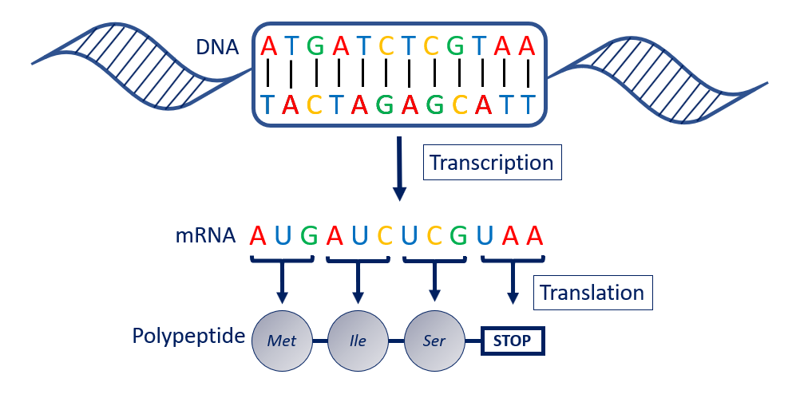
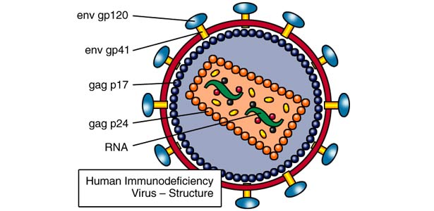
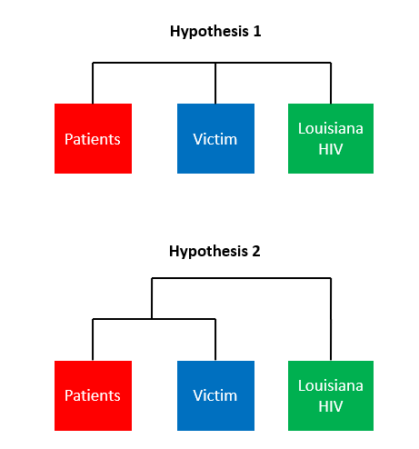

# Whodunit? Forensics with DNA & Bioinformatics Workshop

The workshop will analyze DNA sequence data to identify the gene(s) involved and identify the context of the samples by linking to PubMed records. You will analyze DNA sequence data using local alignment, global alignment, multiple sequence alignment tools and then use your multiple sequence alignment to estimation evolutionary (phylogenetic) relationships amongst the sequences.  With the phylogeny in hand, you will then solve the forensic mystery and decide if the accused is innocent or guilty of an alleged crime. You will gain experience using a diversity of open-access tools that are all available online. 
## Goals:
1. Perform BLAST search to identify sequence region (local alignment)
2. Link to study system via PubMed link on GenBank entry
3. Conduct a multiple sequence alignment (global alignment) using MAFFT
4. Estimate a Neighbor-Joining phylogeny
5. Interpret your phylogenetic estimate relative to the forensics case

### Scenario
You are a researcher in a forensics laboratory. You are contacted by a lawyer representing a victim who accuses her physician of intentionally infecting her with the Human Immunodeficiency Virus (HIV) after their romantic relationship ended. After receiving a vitamin B-12 injection from this doctor, the victim tested positive for HIV. The lawyer alleges that the shot contained infected blood from other HIV positive patients under the doctor’s care. Using HIV sequences from victim, patients of the doctor, and other people in the area, it is up to you to determine if the victim could have contracted HIV from her doctor’s shot or some other source.

### Part 0 - Looking at Sequence Data
1.	Take a look at the [sequence data](whodunit_workshop_data/whodunit_data_subset.fas). This dataset contains multiple sequences in [FASTA](https://blast.ncbi.nlm.nih.gov/Blast.cgi?CMD=Web&PAGE_TYPE=BlastDocs&DOC_TYPE=BlastHelp) format. This is a standard format for DNA sequence data developed by [David Lipman](https://www.amia.org/about-amia/leadership/acmi-fellow/david-j-lipman-md-facmi) and [William Pearson](http://www.people.virginia.edu/~wrp/). 

2. What sort of information does our FASTA file contain? Is this DNA, RNA, or amino acids? Let's think about different possible data formats:

*DNA is transcribed into RNA, which is then translated into amino acids. These amino acids are strung together into polypeptide chains.*

Now that we have determined what format our sequences are, how can we determine the names? Each sequence starts with a title to separate it from others in the same file:

\>**AY156858.1**\_*Vic01*

\>**Accession number**\_*Sample name*

An [accession number](https://www.ncbi.nlm.nih.gov/genbank/sequenceids/) is a unique ID assigned to sequences uploaded to the [GenBank database](https://www.ncbi.nlm.nih.gov/genbank/). GenBank is a genetic sequence database that is publically available and contains millions of genetic sequences that are searchable by anyone. We can search this database using the online software BLAST.

1. Go to [BLAST](https://blast.ncbi.nlm.nih.gov/Blast.cgi) What option(s) might you choose given your data?  Why?
2. Run a BLAST search using the first sequence from your dataset - What are the options? What do these mean?  What are your parameter values?  How do those impact your search?
3. Explore the results of the BLAST search. Click on the accession number of the top hit. What do you think this sequence is? Who did it come from? 

This sequence codes for an HIV enelope glycoprotein. The envelope proteins help HIV viruses fuse to cell membranes and are crucial to infection of cells:

*HIV structure that indicates the envelope glycoproteins ([source](https://microbewiki.kenyon.edu/index.php/HIV_Envelope_and_Cell_Fusion))*

### Part 1 - Creating a Multiple Sequence Alignment (MSA)
You now know that you have sequences from multiple samples and different sources. You need to compare the similarities and differences between the sequences, but how do we do that? 

 

*[source](https://commons.wikimedia.org/wiki/User:Evan-Amos/Food)*

Look at these 2D pictures of a grapefruit and an orange. Are there differences you can see? Are there differences you can’t see in this format (think about size)? If we lined these fruits up, would we be better informed about differences and similarities?

This is why we create multiple sequence alignments! Lining up the sequences helps us determine the similarities and differences among sequences. We do this quickly by using alignment software.

1.	Go to the [MAFFT alignment online software](https://mafft.cbrc.jp/alignment/server/) and explore some ways to create a multiple sequence alignment using all of the [sequence data](whodunit_workshop_data/whodunit_data_subset.fas). If you change default settings, compare with others and see if and what parameters make a big difference in the alignments you create.
2.	Look at the different ways the sequences were aligned. At the bottom of each alignment, there are symbols to indicate shared and different amino acid bases.

|Symbol|Meaning|
:-------:|-------|
|\* | All the sequences are the same
|\. | There are differences between some or all of the sequences

3.	Can you spot some differences between the different sample sequences? Are there shared similarities between Pat samples and Vic samples? What about LA samples?

### Part 2 - Estimating Phylogenetic Relationships and Trees

Now that the sequences are [aligned](whodunit_workshop_data/whodunit_data_aligned.fas) and we can see all the similarities and differences, we need to determine which ones are more and less alike. How can we do that? Let's think back to the fruits...

Think about some charactersitics that are shared among different types of fruits. All fruits are more similar to each other than they are to a vegetable, like an onion. Within fruits however, some are more closely related because of shared characteristics. For example, the orange and grapefruit are more similar to each other than either is to an apple, because they are citrus fruits. Peaches and cherries are more similar to each other than either is to the apple, because they only have a single pit. 

Let’s think about our HIV sequences the same way by estimating a phylogenetic tree. 

1.	Create a hypothesis. If some sequences are more similar to each other, what do you think the tree will look like?
2.	Go back to the alignment you created and create a phylogenetic tree out of the alignment you created. What do you think each of the parameters adjusts? Do you think adjusting these parameters will greatly affect your results?
6.	Look at the tree you made. Do you see any groupings of sequences? Which sequence groups do you think are more or less closely related? Why? 

### Part 3 - Solve a Crime...

1. Think about possible outcomes of this scenario and how that will affect the tree you just estimated. How do the relationships between the victims's samples, patient samples, and Louisiana control samples help us understand possible guilt in this case?

#### Here are two hypotheses:

Hypothesis 1: The doctor is **GUILTY** - The victim's HIV sequences will be more similar to other HIV+ patients than they are to random local HIV+ individuals

Hypothesis 2: the doctor is **NOT GUILTY** - The victim's HIV sequences are not more similar to other HIV+ patients than they are to random local HIV+ individuals

This is what the trees will look like under both hypotheses...

2.	Go back to your original BLAST results. Click on accession number AY156858.1.  Hit the second [PUBMED](https://www.ncbi.nlm.nih.gov/pubmed/) link (to the PNAS paper).  Where does this take you? 
3. Read the abstract, click on the [DOI](https://www.doi.org/). How did your analysis compare to the published study? Guilty or Not Guilty?

More information on this case:

[ABC News](https://abcnews.go.com/Technology/story?id=97856&page=1)

[The Advocate](https://www.theadvocate.com/acadiana/news/article_4f2c8962-fd3c-5fa7-87cf-048188f626e3.html)
